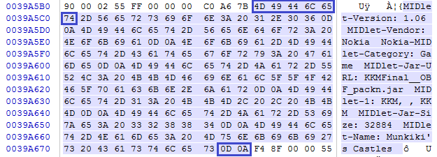
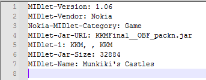

# JAD
*is boring*

# Trivia

## JAD is boring!

* JAD is plaintext
* JAD always contains the word `MIDlet`

JAD is boring!

## JAD example
*taken from [Wikipedia](https://en.wikipedia.org/wiki/JAD_(file_format)#Example)*

```
Manifest-Version: 1.0
Created-By: Apache Ant 1.5.1
MIDlet-1: Book Reader by TC, , br.BookReader
MIDlet-Name: BookReader
MIDlet-Vendor: tequilaCat
MIDlet-Version: 1.3.6
MicroEdition-Configuration: CLDC-1.0
MicroEdition-Profile: MIDP-1.0
MIDlet-Jar-Size: 24575
MIDlet-Jar-URL: bookreader.jar
TC-BookReader-Logging: true
```

# Extraction steps

# Tools used

* Input BLOB file  
* Trusty HEX editor with the ability to copy selections to new files. Such as WinHex.  
* [Notepad++](https://notepad-plus-plus.org) – to visually verify the .JAD file.  

## Additional resources

* [JAD specifications (JSR118)](http://download.oracle.com/otn-pub/jcp/midp-2.1-mrel-oth-JSpec/midp-2_1-mrel-spec.pdf)  

# Step 1 – Find JAD file

Finding JAD is easy.

JAD is entirely plaintext. Not even JSON.

JAD follows the following basic structure:
```
Parameter: Value
```  
followed by a newline.

JAD practically always contains parameter keyword `MIDlet`. Furthermore, it practically always parameters:
* **`MIDlet-Name`**
* **`MIDlet-Version`**
* **`MIDlet-Vendor`**
* **`MIDlet-Jar-URL`**
* **`MIDlet-Jar-Size`**
* **`MicroEdition-Profile`**
 
Finding a .JAD is just a matter of finding any of these keywords and / or parameters.

 # Step 2 – Locate JAD's end
 
* JAD file contains many `0x0D 0x0A`, however, it always ends with `0D 0A`. 
 
* These bytes correspond to... `\r\n` or `CRLF`, [(source)](https://stackoverflow.com/a/71531204/12258312). This combination of bytes is used in Windows, DOS, Symbian, and others as a newline character, [(source)](https://stackoverflow.com/a/1552782/12258312).
 
 * Hence, you only need to find the last `CRLF` (HEX `0D 0A`), after which, there is no plaintext syntax of,  
	```
	Parameter: Value
	```  
 
This "locate" operation takes about 30 seconds.
 
 # Step 3 – Locate JAD's beginning
 
 Very similar process to "Step 2 – Locate JAD's end"
 
 you only need to find:
 * the first entry before the JAD's end
 * that follows the plaintext syntax of,  
	```
	Parameter: Value
	```  
	
Highly likely, this first entry with begin with the keyword `MIDlet`

This second "locate" operation takes about 20 seconds.

# Step 4 – Slice out into a file

 |
---- | 
Example JAD file slice. Notice `0D 0A` at the slice's end, and keyword `MIDlet` at the beginning.

# Step 5 – Verify results

 | 
---- | 
.JAD file in Notepad++

Ensure that,

* JAD file (as it typically does) starts with `MIDlet` keyword.
* There are no obvious errors visible to the naked eye.
* Trailing newline is present.

---------------------------------

***[Tim Abdiukov](https://github.com/TAbdiukov)***
