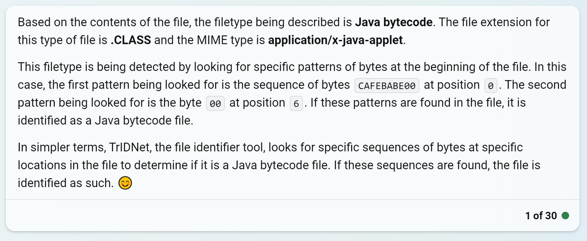

# .class extraction
*βeta version*

The guide is based on the previous private research.

## Tools used

* Input BLOB file  
* [TrIDNet + TrID XML Defs](https://mark0.net/soft-tridnet-e.html)  
* [HexWalk](https://github.com/gcarmix/HexWalk/) – [(more info)](https://github.com/TAbdiukov/extract/blob/main/JAR.md)  / <ins>binwalk</ins>.
* Trusty HEX editor with the ability to copy selections to new files. Such as WinHex.  
* [Java Decompilers Online](http://www.javadecompilers.com/) – for verification.

## Header

**[Click here to jump to answer!](./class.md#conclusion)**

### Researching TrID

1. Download [TrIDNet + TrID XML Defs](https://mark0.net/soft-tridnet-e.html)  
2. Extract TrIDNet
3. Extract TrID XML Defs in the same folder as TrIDNet
4. Run TrIDNet. It will take some time (~1-2 minutes) to index Defs
5. Test run: Run TrIDNet against any known file. In this example, `C:\Data\flirt.zip`. Observe successful detection. Hence, we can conclude that TrIDNet is functional.  
	
6. Use TrIDNet against a known .class file. For example, against an example `KKM.class` . Observe successful detection of `Java Bytecode`,  
	
7. Double-click on the arrow on the left for a more detailed result. Take note of the Def used, in this case, `\defs\j\java-class.trid.xml`  
	
8. Examine `\defs\j\java-class.trid.xml`. We are only interested in the bits below.  
	
9. Notice that the `Pattern` is: `CAFEBABE00` at pos 0 and `00` at pos 6. If I take the liberty of saying that `XX` means (anything at all), then our pattern is,
	```
	00 01 02 03 04 05 06
	CA FE BA BE 00 XX 00
	```

*Bonus step*: Let's ask ChatGPT 4 about it!
> Hi, I have the following information, ```(java-class.trid.xml contents)```. This is the data from file that contains filetype definitions for TrIDNet, a file identifier tool. I have 3 questions,
> 1. Based on file contents, what filetype is being described
> 2. Based on file contents, how exactly is this filetype being detected? Please explain technicalities of this definition in language humans can easily understand. 

Result,
	

And obviously, this result is in line with my conclusions.

### But CAFE BABE is not so simple


HexWalk sometimes can detect CAFE BABE as "Mach-O binary",  
	

It turns out that HexWalk's detection is not exactly a fluke. Mach-O is an executable file format, used in 1990s NeXTSTEP, macOS and iOS – in Apple Operating Systems that is!

Mach-O supports multiple architectures. `Mach-O 4 arch` implies that the supposed executable is made for 4 architectures.

#### 2022 comes to rescue

This brilliant [2022 StackOverflow discussion](https://stackoverflow.com/q/73546728) is about this exact topic,

Question,  
> Both Java `.class` files and Mach-O fat binaries have the same magic signature, 0xCAFEBABE. When reading binary files, what's a good way to disambiguate?

Answer,  

> Here's Apple take on this:
https://opensource.apple.com/source/file/file-80.40.2/file/magic/Magdir/cafebabe.auto.html
> ...
> 
> Here's a visual comparison:


>
> So it seems currently Apple does the 
>
>     (int32 at offset4) < 0x20 
>
> Since even Apple calls it a hack unfortunately there's no 100% reliable method, but it seems that's your best shot. You can always be dealing with malformed (deliberately or not) `fat Mach-o files` or `Java class files` which may or may not be relevant for your use case. 

In other words, (if we count from 1 in the post, and given the context): if the second-from-the-start set of 4 bytes is:

* Less than 32, then it is a Mach-O header
	* Therefore, Mach-O necessitates `00 00 00 XX` syntax
* Greater or equal to 32, then it is a Java class header
	* Since Java class's second-from-the-start set of 4 bytes must be `00 XX 00 XX`, either the second byte must be greater than 0, or the fourth byte must be greater than 32,
* Anything else: invalid case

##### And even before 2022 – Aug 2020


This ambiguity between Java class and Mach-O prompted a request for update of TrID – a tool I rely on to detect file extensions.

* [replacement for java-class.trid.xml, exe-ub.trid.xml; CAFEBABE magic](https://mark0.net/forum/index.php?topic=801.0) (from August 24, 2020)


### Conclusion

If I take the liberty of saying that `XX` means (anything at all), then the .class file header must,  

1. Have the following syntax/pattern,

	```
	00 01 02 03 04 05 06 07
	CA FE BA BE 00 XX 00 XX
	```

2. Satisfy at least one of the following conditions,  
	i. Byte `0x05` must be greater than 0,  
	ii. Byte `0x07` must be greater or equal to 32 (`0x20` ).  
	
## Footer

To be researched further. It appears that the last bytes are **not** always completely NULL-padded.

However, generally, extracting more is safer than extracting less, as additional data is usually ignored, unused, warned about, or just truncated by whatever is interpreting it.

[Java Decompilers Online](http://www.javadecompilers.com/) (or their offline counterparts, such Kali Linux's `jd`) can be used for information verification purposes.
		
---------------------------------

***[Tim Abdiukov](https://github.com/TAbdiukov)***
